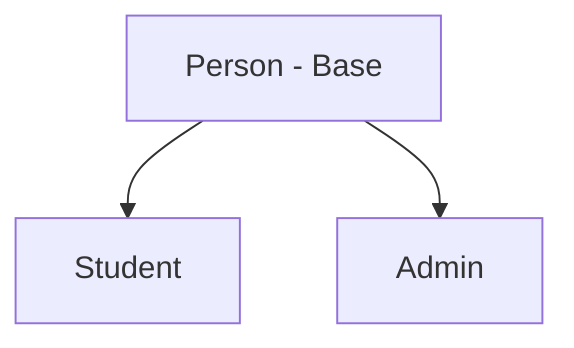
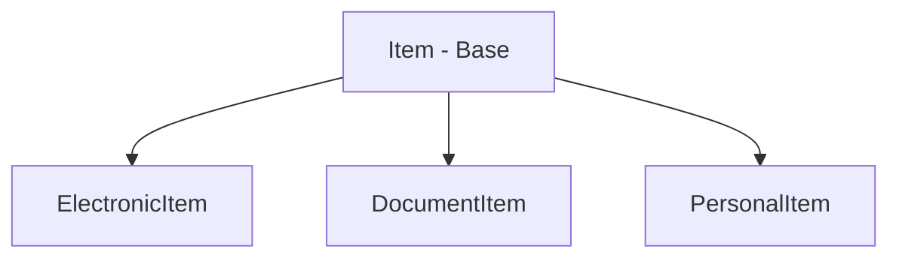
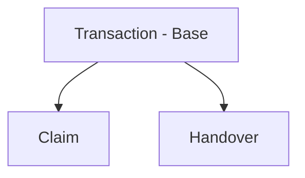

# 🔍 CampusTrace: University Lost & Found System

[](https://en.wikipedia.org/wiki/C%2B%2B11)
[](https://opensource.org/licenses/MIT)
[]()

**CampusTrace** is a robust C++ OOP-based management system designed to solve the chaos of university lost and found processes. Currently, most campuses rely on disorganized WhatsApp groups with no tracking or accountability. CampusTrace replaces this with a formal, structured, and secure digital solution.

---

## 🚀 The Problem
WhatsApp groups are great for chatting but terrible for item tracking:
- ❌ **No item history:** Messages get buried.
- ❌ **No formal claims:** Anyone can claim anything.
- ❌ **No accountability:** No records of handovers.
- ❌ **Privacy Issues:** Personal contact info exposed publicly.

**CampusTrace** introduces a verified claim process, item lifecycle management, and a trust-based flagging system for students.

---

## 🏗️ Architecture (OOP Design)

The system is built on **Hierarchical Inheritance** across three main trees to ensure scalability and polymorphism.

### 1. User Hierarchy


### 2. Item Hierarchy


### 3. Transaction Hierarchy


---

## ✨ Key Features (MVP)
- **M1:** Admin registration & centralized item logging.
- **M2:** Advanced keyword-based search for students.
- **M3:** Formal claim submission with proof requirements.
- **M4:** Admin review workflow (Approve/Reject).
- **M5:** Complete item lifecycle (Found → UnderReview → Claimed → Returned).
- **M6:** Verified handover receipts.
- **M7:** Dispute handling for multiple claimants.
- **M8:** Data persistence via file handling.
- **M9:** Auto-expiry for unclaimed items (30 days).
- **M10:** Student trust flagging based on rejection history.

---

## 📂 Project Structure
```text
CampusTrace/
├── include/    # Class declarations (.h)
├── src/        # Implementation logic (.cpp)
├── data/       # Persistent storage (txt files)
└── main.cpp    # Application entry point
```

---

## 👥 The Team
- **Ali Sufian (Leader):** Core Auth, User Logic, Reporting & Main Integration.
- **Amina Shafique:** Item Specialization & Polymorphic Item Logic.
- **Umama Khurram:** Transaction Engine, File Management & Search Logic.

---

## 🛠️ Getting Started

### Prerequisites
- C++11 compatible compiler (GCC, Clang, or MSVC)
- Git

### Installation
1. Clone the repository:
   ```bash
   git clone https://github.com/alisufiankhan/CampusTrace.git
   ```
2. Navigate to the project directory:
   ```bash
   cd CampusTrace
   ```
3. Compile the project (example using g++):
   ```bash
   g++ -Iinclude main.cpp src/*.cpp -o CampusTrace
   ```
4. Run the application:
   ```bash
   ./CampusTrace
   ```

---

## ⚖️ License
Distributed under the MIT License. See `LICENSE` for more information.

---
<p align="center">Made with ❤️ for University Campus Accountability</p>
